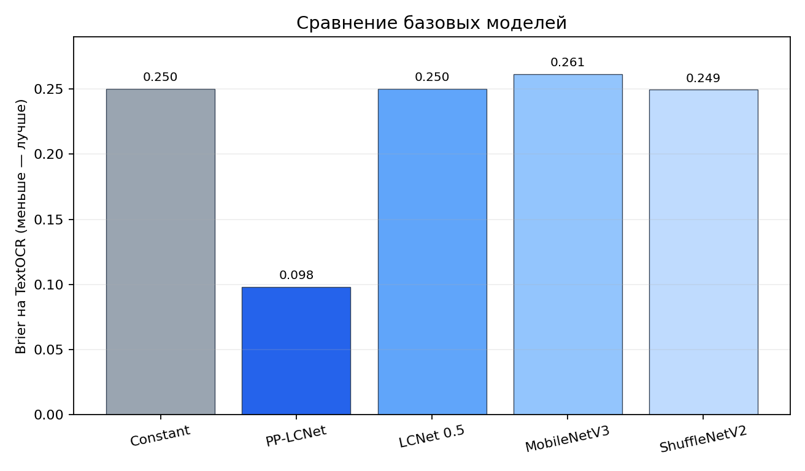
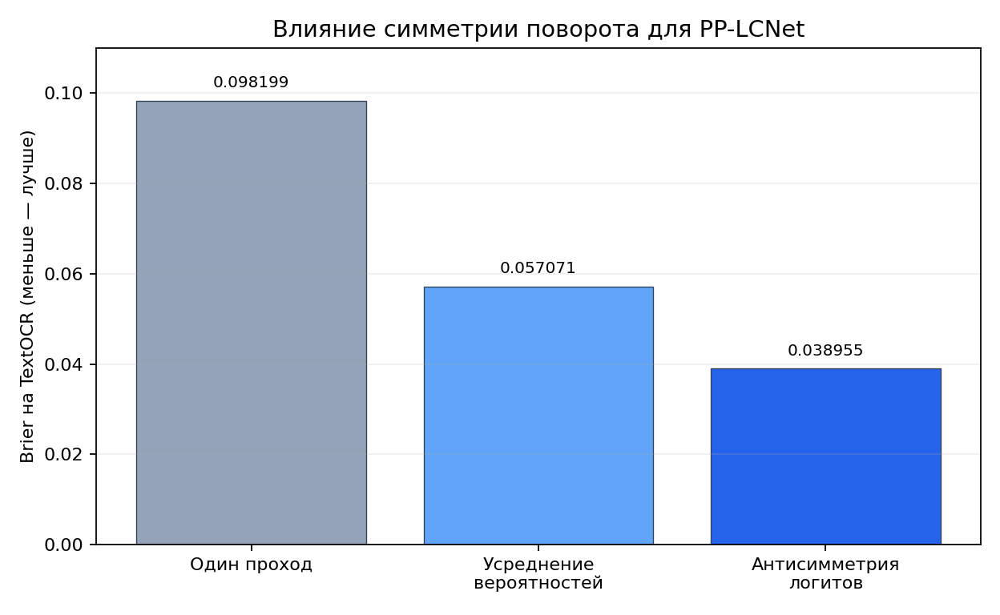
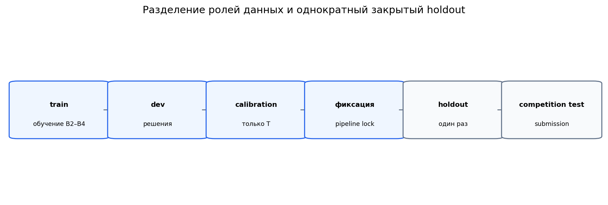

# Вступление
Вероятно это далеко не самое сильно решение, но в рамках временных и вычислительных возможностей получилось неплохо, было много моментов проверяющих понимание, если не хватило моментов с каким-то дообучением, то вполне могу покрыть любые сомнения непосредственно собесом.
# Определение ориентации текста 0° / 180°
Сначала я оценил, какие изображения встречаются в competition test. Затем сравнили готовую специализированную модель с несколькими компактными сетями, проверили синтетические данные и только после этого сосредоточились на свойстве самой задачи: при повороте на 180° ответ должен меняться на противоположный.
В итоге лучший pipeline получился достаточно простым: **PP-LCNet x0.25**, два прохода для `x` и `R180(x)`, антисимметризация логитов и temperature scaling. Ни OCR, ни INT8 в финальную версию не вошли - измерения не показали пользы, которая оправдывала бы дополнительную сложность.
## Сначала посмотрел на данные
Первым делом я посмотрел, какие изображения вообще встречаются в competition test. В нём 20 000 RGB-кропов без альфа-канала: короткие надписи, длинные строки, вывески, адреса, логотипы, упаковка, кириллица, латиница и цифры. Часть изображений цветная, часть почти монохромная; встречается низкий контраст и очень небольшая высота текста.
Несколько чисел особенно повлияли на дальнейшие проверки:
- `16.52%` изображений имеют высоту меньше 24 px;
- `14.03%` имеют aspect ratio больше 10;
- `21.14%` почти монохромны;
- точных дубликатов не найдено.
После этого стало понятно, какие вещи стоит проверять отдельно: маленькие кропы, длинные строки и разрыв между synthetic и real data. Эти наблюдения помогли настроить геометрию генератора и выбрать срезы для анализа, но не использовались как аргумент в пользу конкретной архитектуры.
Competition test не размечался вручную и не использовался для обучения, калибровки или выбора модели. Его пиксели не становились обучающими примерами.
Подробнее о данных: [docs/DATA_AND_VALIDATION.md](docs/DATA_AND_VALIDATION.md).
## Попробовали несколько базовых моделей
Самая простая отправная точка - всегда предсказывать `p_180=0.5`. Такой прогноз всегда даёт Brier `0.25` для бинарной метки `y∈{0,1}` и служит удобной контрольной точкой.
Здесь `p` - предсказанная вероятность, а `y` - истинный класс 0 или 1:
\[
\mathrm{Brier}=\frac{1}{N}\sum_i(p_i-y_i)^2,
\qquad \mathrm{score}=1-\mathrm{Brier}.
\]
Brier учитывает не только правильную сторону порога 0.5, но и уверенность. Поэтому уверенная ошибка стоит дороже осторожной, а хорошо откалиброванные вероятности важны не меньше accuracy.
Я сравнил постоянный baseline, официальную PP-LCNet для ориентации текста и три компактные сети, которые обучались локально при одинаковом коротком бюджете(gpu нету и времени было не оч много).
| Модель | Инициализация | Brier на TextOCR | Веса | Что решил |
|---|---|---:|---:|---|
| Constant `p=0.5` | нет | 0.250000 | 0 MB | контрольная точка |
| PP-LCNet x0.25 | специализированные pretrained weights | **0.098199** | 0.985712 MB | основной кандидат |
| LCNet 0.5 | с нуля | 0.250275 | 2.476447 MB | не продолжать |
| MobileNetV3-Small | с нуля | 0.261383 | 6.194421 MB | не продолжать |
| ShuffleNetV2 0.5x | с нуля | 0.249445 | 1.496035 MB | оставить для обучающих абляций |
PP-LCNet сразу сильно выделилась на фоне остальных. При этом PP-LCNet использовала специализированные pretrained weights, а B2-B4 обучались с нуля всего 800 шагов.
Поэтому из эксперимента нельзя сделать вывод, что сама архитектура PP-LCNet всегда лучше. Но для нашей конкретной задачи готовая специализированная модель оказалась значительно сильнее того, что я успел обучить с нуля в пределах вычислительного бюджета.

## Откуда взялась синтетика
Чтобы всё же обучать B2-B4, я генерировал изображение правильно ориентированного текста, применял к нему фон, освещение, blur, уменьшение, шум и JPEG, а затем получал класс 180° точным поворотом.
Так метки известны автоматически, а оба изображения пары идеально согласованы: набор пикселей один и тот же, меняется только ориентация. Если бы деградации применялись независимо, модель могла бы связать класс со случайным шумом или качеством JPEG.
Generator v1.1 имитировал вывески, адресные таблички, рекламу, упаковку, ценники и надписи в стиле логотипов. Сначала проверил, действительно ли эта более реалистичная схема полезнее простого текста на простом фоне.
| Вариант данных для ShuffleNetV2 | Brier на TextOCR dev |
|---|---:|
| realistic synthetic, 0% реальных общих данных | **0.251392** |
| простой synthetic | 0.280964 |
Более реалистичный генератор действительно помог, но ShuffleNetV2 всё равно оставалась далека от PP-LCNet. Кроме того, совпадение размеров не устранило разницу во внешнем виде: средняя энтропия синтетики была `4.782`, а test - `6.182`; доля почти серых пикселей - `0.555` против `0.405`.
Затем добавлял в обучение немного реальных TextOCR-кропов:
| TextOCR в смеси | Brier на TextOCR dev |
|---:|---:|
| 0% | 0.251392 |
| 5%, первый seed | **0.248635** |
| 10% | 0.250130 |
| 20% | 0.250549 |
| 5%, второй seed | 0.250277 |
5% TextOCR дали лучший результат в первом запуске, но повтор с другим seed показал более слабый эффект. Поэтому я не считал 5% найденным оптимумом - это был только рабочий состав данных для ShuffleNetV2.
**Синтетика и эта смесь не использовались для обучения финальных весов PP-LCNet.** Финальная модель использует готовые официальные pretrained weights.
Небольшую воспроизводимую демонстрацию генератора можно запустить в [generator.ipynb](generator.ipynb). По умолчанию он создаёт только три пары в памяти, а не полный набор данных.
## Реальные данные и TextOCR
Синтетика удобна тем, что даёт точные метки, но реальные фотографии выглядят иначе. Поэтому TextOCR стал основной внешней проверкой на реальном scene text.
Все связанные кропы одной исходной сцены сохранялись в одной группе. Разбиение делалось до поворотов и аугментаций, чтобы две версии одного изображения не оказались в разных частях оценки. У частей данных были разные роли:
- `train` - только обучение B2–B4;
- `dev` - сравнение моделей и вариантов pipeline;
- `calibration` - только подбор температуры;
- `holdout` - однократная проверка после полной фиксации решения.
Главное ограничение здесь языковое: доступная часть TextOCR - преимущественно латинский текст. Отдельной проверенной валидации на реальной кириллице у меня не было. Поэтому TextOCR позволяет проверить перенос на реальные изображения, но не закрывает риск, связанный с кириллицей в конкурсном домене.
## Почему некоторое время шёл по B4
ShuffleNetV2 0.5x, или B4, была удобной обучаемой моделью: на ней можно было в одинаковых условиях сравнивать генератор, состав данных и разрешение. Именно поэтому значительная часть абляций продолжилась на B4.
На ней я выяснил, что realistic synthetic лучше simple synthetic, 5% TextOCR - только нестабильный рабочий вариант, а увеличение высоты с 48 до 64 ухудшает Brier с `0.248635` до `0.256632`. Длинные строки не показали достаточной деградации, чтобы запускать windowing start/center/end.
Но на этом этапе я слишком долго продолжал оптимизировать B4. Когда кандидатов напрямую сравнили ещё раз на одних и тех же 500 группах TextOCR dev, разрыв выглядел так:
| Вариант | Brier |
|---|---:|
| B1 PP-LCNet, native preprocessing | 0.098199 |
| B4 после абляций | около 0.2486 |
| B1 после symmetry и calibration | около 0.039–0.040 |
После этого дальнейшая оптимизация B4 уже не имела смысла для финального submission, и я вернулися к PP-LCNet. Настройки B4 - её resize, способ инференса и температура - на B1 не переносились.
Подробная хронология, включая неудачные ветки: [docs/EXPERIMENTS.md](docs/EXPERIMENTS.md).
## Самое сильное улучшение - использовать симметрию задачи
Если повернуть изображение ещё раз на 180°, ответ должен поменяться на противоположный:
\[
p(R_{180}(x))\approx 1-p(x).
\]
Один проход модели этого свойства не гарантирует. Поэтому я сравнили три варианта на PP-LCNet:
| Способ | Что делаем | Brier на TextOCR dev |
|---|---|---:|
| один проход | используем только `p(x)` | 0.098199 |
| усреднение вероятностей | усредняем `p(x)` и `1-p(R180(x))` | 0.057071 |
| антисимметризация логитов | объединяем ответы до sigmoid | **0.038955** |
В последнем варианте сначала переводим ответы в логиты и строим один согласованный логит:
\[
z_{sym}=\frac{z(x)-z(R_{180}(x))}{2}.
\]
Такая формула автоматически даёт противоположный ответ для повёрнутой пары. Именно это изменение принесло самый большой прирост качества во всём проекте.
Цена - два forward pass вместо одного. Однако веса PP-LCNet занимают меньше 1 MB, поэтому итоговая задержка осталась небольшой.

## Зачем понадобилась температура
После symmetry модель уже хорошо определяла класс, но Brier оценивает ещё и то, насколько хорошо откалибрована вероятность. Для этого я использовал один скалярный параметр:
\[
p_{180}=\sigma\left(\frac{z_{sym}}{T}\right),
\qquad T=0.8572522561367453.
\]
`T` подбиралась исключительно на calibration split после выбора модели, native preprocessing и антисимметрии. Dev не использовалась для подбора температуры, holdout оставался закрытым, а competition test не использовался для настройки `T`.
На calibration Brier прямого Paddle runtime изменился с `0.035997` до `0.035734`. Улучшение небольшое, но получено без усложнения финального пути.
## Что ещё попробовал
| Идея | Зачем проверял | Что получилось | Что сделал |
|---|---|---|---|
| simple synthetic | понять, нужны ли реалистичные деградации | 0.280964 против 0.251392 | оставили generator v1.1 |
| 10–20% TextOCR | проверить пользу большей доли real data для B4 | хуже первого запуска с 5% | не увеличивал долю |
| B4 h64 | сохранить больше деталей в маленьком тексте | 0.256632 против 0.248635 при h48 | оставил h48 для B4 |
| windowing | помочь длинным строкам | на B4 не было требуемой деградации AR>12 | не запускал лишний grid search |
| OCR blend | добавить языковой сигнал | Brier не улучшился, p50 около 36.2 ms | OCR отключил |
| oneDNN FP32 | ускорить runtime | тот же Brier, но хуже full-path p50 | выбрали direct Paddle FP32 |
| INT8-флаг | уменьшить задержку и размер | реальный quantized artifact не получен, ускорения нет | оставил FP32 |
| B4 как финал | использовать локально обучаемую компактную модель | Brier оставался около 0.249 | вернулся к B1 |
Если идея не улучшала Brier или слишком дорого стоила по latency, в финальный pipeline её не оставлял. Результат с INT8 не доказывает бесполезность полноценного PTQ/QAT - только то, что доступная проверка runtime-флага не дала рабочего квантованного артефакта.
## Как следил, чтобы не переобучиться на валидацию
Каждая часть данных отвечала только за свой этап:
```text
train → обучение B2–B4
 dev → выбор модели и pipeline
 calibration → только температура T
 pipeline lock → полная фиксация решения
 holdout → одна итоговая внутренняя проверка
 competition test → только submission
```
Пересечения исходных групп между `dev/calibration`, `dev/holdout` и `calibration/holdout` равны нулю. Holdout открыл только после того, как были зафиксированы архитектура, веса и их SHA256, preprocessing, symmetry, температура, backend и отключённые OCR/INT8. После просмотра holdout pipeline не меняли.
| Оценка | Brier |
|---|---:|
| Dev | 0.039221 |
| Закрытый внутренний holdout | 0.040032 |
| Разница | 0.000811 |
Dev и holdout получились очень близкими, поэтому внутри нашей схемы валидации решение выглядит стабильным.

## Дополнительный synthetic stress-test
После фиксации решения захотелось отдельно посмотреть, где модель ломается на полностью контролируемых данных. Сгенерировал 5 000 групп, или 10 000 изображений, с seed `20261217`. Никакого обучения, настройки параметров или использования competition test в этой проверке не было.
| Вариант | Brier | Accuracy |
|---|---:|---:|
| один проход | 0.188459 | 0.763700 |
| антисимметрия без calibration | **0.138461** | 0.808200 |
| финальный pipeline с `T` | 0.142883 | 0.808200 |
Главные наблюдения:
1. антисимметрия снова заметно помогает;
2. температура, выбранная на реальном calibration split, немного ухудшает synthetic Brier - менять её из-за этого всё равно не стоит;
3. самым сложным оказался срез `aspect_ratio > 20`: `N=152`, Brier `0.348859`;
4. ошибка парной симметрии находится на уровне численной точности, около `1e-16`;
5. генератор этого теста создавал только кириллические строки с возможными цифрами, поэтому строго судить о качестве нельзя.
Полные числа и срезы: [docs/SYNTHETIC_STRESS_TEST.md](docs/SYNTHETIC_STRESS_TEST.md).
## Что в итоге осталось
| Часть pipeline | Финальная настройка |
|---|---|
| Модель | official PP-LCNet x0.25 text orientation |
| Вход | RGB, fixed `160×80` |
| Инференс | исходное изображение + точный `R180(x)` |
| Объединение | `z_sym = (z(x) - z(R180(x))) / 2` |
| Calibration | `sigmoid(z_sym / T)`, `T = 0.8572522561367453` |
| Backend | direct Paddle Inference FP32 CPU, 1 thread |
| OCR | off |
| INT8 | off |
| Dev Brier | 0.039221 |
| Закрытый holdout Brier | 0.040032 |
| Внутренний holdout score | 0.959968 |
| Веса | 0.985712 MB |
**`0.959968` - внутренняя оценка на нашем holdout.**
## Скорость
Финальный benchmark включает весь путь: чтение файла, native preprocessing, два прохода, антисимметрию и temperature scaling. Измерение проводилось с batch 1 и одним CPU thread.
| Показатель | Значение |
|---|---:|
| latency p50 | 3.302 ms |
| latency p95 | 9.031 ms |
| throughput | 284.632 бокса/с |
| веса | 0.985712 MB |
| весь model bundle | 1.090571 MB |
Скорость зависит от процессора, версий библиотек и фоновой нагрузки. Поэтому эти значения описывают конкретное окружение финального benchmark, а не гарантированную задержку на любой машине.
## Как запустить
```bash
python -m venv .venv
# Linux / macOS
source .venv/bin/activate
# Windows PowerShell
# .venv\Scripts\Activate.ps1
pip install -r requirements.txt
jupyter lab Inference.ipynb
```
По умолчанию notebook ищет:
```text
./test/images
./sample_submission.csv
```
Для другого размещения задайте `AVITO_TEST_DIR` и `AVITO_SAMPLE_SUBMISSION`, затем выполните `Run All`. Результат появится в `outputs/submission.csv`.
Контрольные суммы:
```text
weights/inference.pdiparams
08ee1ce4bcdb30dd4e784862334d1df49d80a600294d75daae4ca4c70bc860e9
outputs/submission.csv
2a7f5c375454a1193a872a53d600214e5cb79df9c1a9906191b7d1c2b1121c86
```
## Что у решения пока не проверено
- **Реальная кириллица.** TextOCR преимущественно содержит Latin/general scene text.
- **Разрыв между synthetic и real data.** Генератор приблизил геометрию, но не полностью воспроизвёл энтропию, цвет и характер шума реальных изображений.
- **Равное сравнение архитектур.** PP-LCNet имела специализированные pretrained weights, тогда как B2-B4 обучались с нуля на коротком бюджете.
- **Resolution и windowing именно для B1.** Эти абляции выполнялись на B4, поэтому их нельзя автоматически переносить на финальную модель.
- **Официальный leaderboard.** Внутренний holdout не совпадает со скрытым competition test.
- **Скорость на другом оборудовании.** CPU timing зависит от машины и программного окружения.
- **Synthetic stress-test как реальная оценка.** Он полезен для диагностики, но не заменяет валидацию на фотографиях.
## Что можно попробовать дальше
Все пункты ниже - **future work; они не тестировались в финальном решении и не являются обещанием улучшения**.
### Реальная кириллица
Самое полезное продолжение - собрать лицензированный набор реальных кириллических вывесок, упаковки и коротких строк с надёжной ориентацией. Это позволит отдельно проверить главный языковой риск и не смешивать его с преимущественно латинским/general scene-text доменом TextOCR.
### Head-only fine-tuning PP-LCNet
Можно заморозить backbone и обучить только классификационную голову на новых реальных данных. Такой вариант дешевле полного обучения, но всё равно потребует отдельного dev и контроля ухудшения на общем scene text.
### Частичное дообучение и pretrained compact models
Следующий шаг после head-only — разморозить несколько последних блоков PP-LCNet. Параллельно имеет смысл сравнить компактные альтернативы с подходящими pretrained weights: текущее сравнение с B2–B4 было неравным по инициализации.
### Длинные строки
Synthetic stress-test указывает на слабость при длинные строках. Для B1 стоит отдельно сравнить native resize с ограниченным windowing или другим способом обработки длинных строк, обязательно учитывая полную latency.
### Сильный ensemble
Ансамбль может улучшить качество, если ошибки моделей различаются, но почти наверняка увеличит размер и задержку. Для массового инференса такой обмен между качеством и скоростью может оказаться невыгодным.
## Что лежит в репозитории
- [Inference.ipynb](Inference.ipynb) — финальный инференс, проверка весов и воспроизведение submission.
- [generator.ipynb](generator.ipynb) — небольшой детерминированный пример synthetic v1.1; финальные веса он не обучает.
- [src/final_runtime.py](src/final_runtime.py) — только финальный Paddle runtime.
- `weights/` — точный model bundle PP-LCNet.
- `outputs/submission.csv` — неизменённый финальный ответ.
- [docs/EXPERIMENTS.md](docs/EXPERIMENTS.md) — подробная история экспериментов.
- [docs/DATA_AND_VALIDATION.md](docs/DATA_AND_VALIDATION.md) — источники данных, разбиения и защита от утечек.
- [docs/SYNTHETIC_STRESS_TEST.md](docs/SYNTHETIC_STRESS_TEST.md) — полный отчёт дополнительной диагностики.
- [results/experiments.csv](results/experiments.csv) — сводная таблица результатов.
- [results/final_metrics.json](results/final_metrics.json) — финальные внутренние метрики и benchmark.
- `results/figures/` — три иллюстрации основных сравнений.
- [checksums.txt](checksums.txt) — SHA256 весов и submission.
- [THIRD_PARTY_NOTICES.md](THIRD_PARTY_NOTICES.md) — какие внешние модели, данные и библиотеки использовались и какую роль они играли в проекте.